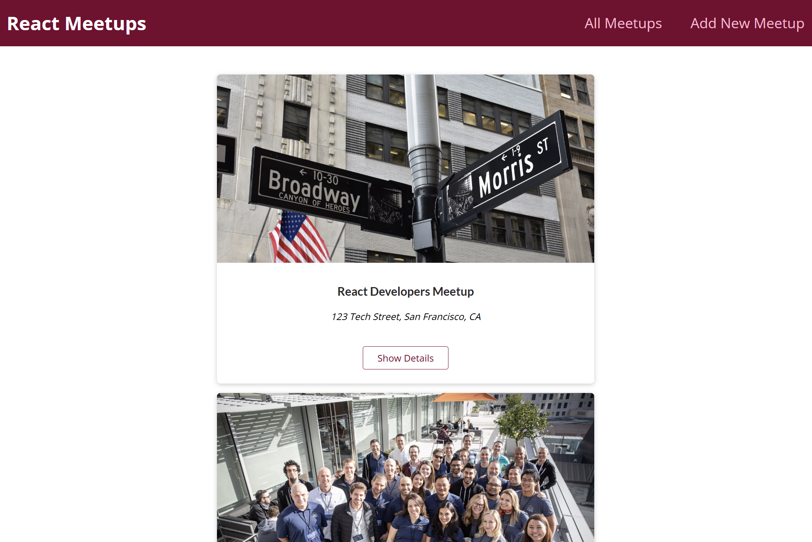
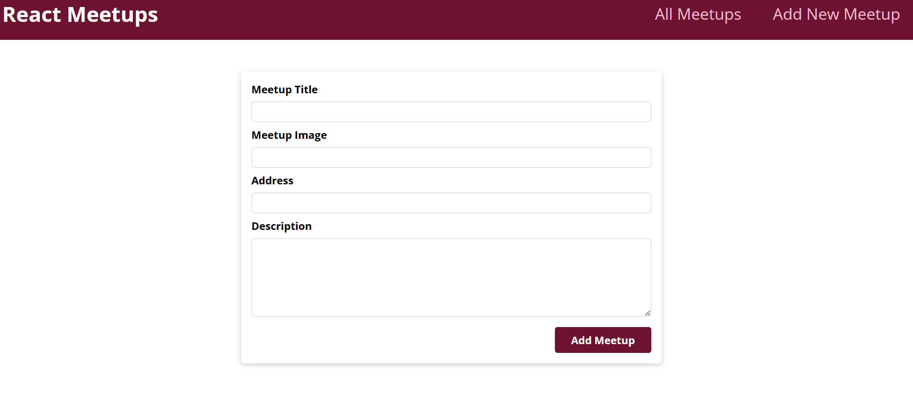

# Meetups App

A **Next.js 13** (Pages Router) demo application for practicing fundamental routing patterns:
static pages, nested routes, and dynamic route segments.

## Features

- Home page at `/`
- News listing page at `/news`
- Dynamic news detail page at `/news/[newsId]`
- Client-side navigation via `next/link`
- Route param access with `useRouter().query`

## Tech Stack

- **Framework**: Next.js 13 (React 18, Pages Router)
- **Styling**: Global CSS (`styles/globals.css`)
- **Language**: JavaScript

## Requirements

- **Node.js**: 18+ (recommended 20+)
- **npm**: comes with Node.js

## Getting Started

### Clone the repository

```bash
git clone https://github.com/vasylpryimakdev/meetups-app.git
cd meetups-app
```

Install dependencies:

```bash
npm install
```

### Run the app

Start the development server:

```bash
npm run dev
```

Open `http://localhost:3000`.

## Scripts

- **dev**: `next dev`
- **build**: `next build`
- **start**: `next start`

## Routing Map

Route-to-file mapping in the `pages/` directory:

- `/` -> `pages/index.js`
- `/news` -> `pages/news/index.js`
- `/news/:newsId` -> `pages/news/[newsId].js`

Example dynamic URL:

- `/news/nextjs-is-a-great-framework`

## Project Structure

```text
pages/
  _app.js             # Global app wrapper
  index.js            # Home page
  news/
    index.js          # News list page
    [newsId].js       # Dynamic news detail page
styles/
  globals.css         # Global styles
public/
  vercel.svg
package.json
package-lock.json
```

## Screenshots

Add screenshots to `./public/screenshots/` and update this section as needed.

### Preview

| Home | New Meetup |
| --- | --- |
|  |  |

## Notes

- This project is intentionally minimal and focused on routing fundamentals.
- News items are currently hardcoded in `pages/news/index.js`.
- `pages/news/[newsId].js` demonstrates param reading (`router.query.newsId`) and can be extended with real data fetching.
- This codebase uses the **Pages Router** (`pages/`), not the App Router (`app/`).

